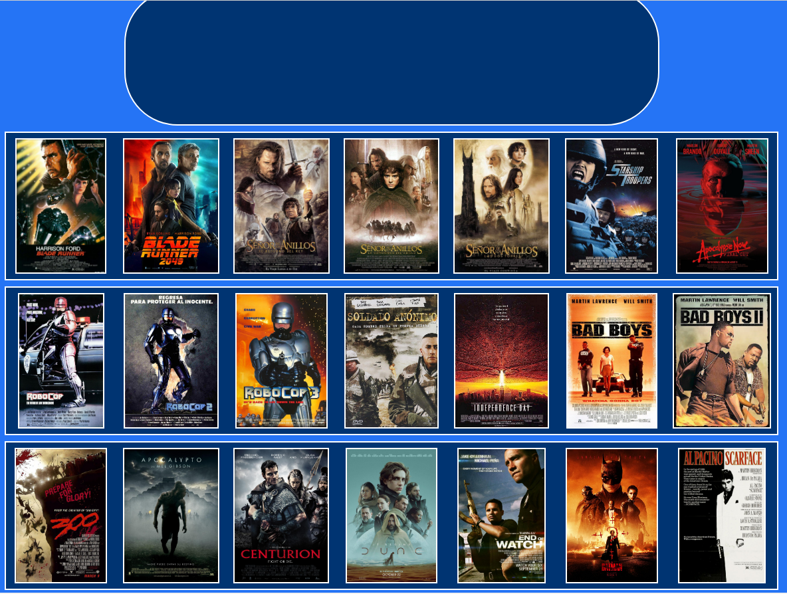
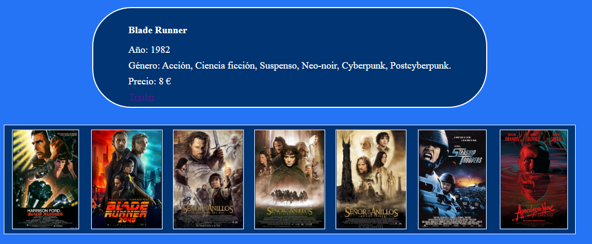
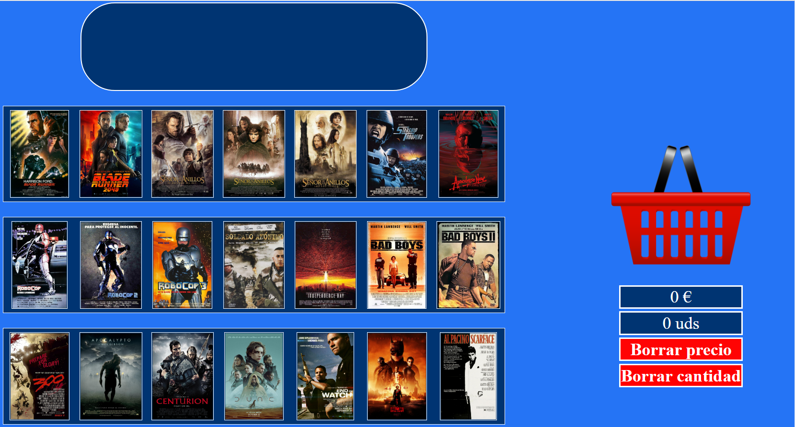

Proyecto Final - Showcase Dinámico

Alumno : Cristian Roldan

Fecha de creacion del trabajo: Viernes 23 de septiembre.
Fecha de entrega del trabajo: Jueves 29 de Septiembre.

En este proyecto final tenemos la finalidad de crear un Showcase Dinámico, en el cual tenemos que utilizar las funciones de Drag & Drop para poder arrastrar una serie de objetos de un lugar a otro.
Esto sumará el valor del producto al total de los objetos, que se mostrarán en todo momento al usuario.

Para realizar este proyecto se han utilizado las siguientes tecnologías:
● HTML5
● CSS3
● JavaScript - ES6
● Git

Para realizar el proyecto, decidí utilizar una temática de pagina sobre compra ventas de películas.
Primero seleccione un total de 21 caratulas de películas en google, las cuales serian los objetos para arrastrar, cada una de esta imagen es una película con su información y precio.
De la parte contraria hay una cesta y un total de cuatros casillas, las dos primeras señalan la suma de los precios y la cantidad de productos depositados en la cesta. Las dos ultimas casillas son botones para resetear el precio y la cantidad.

En el proceso del proyecto aparecieron diversos bugs, debido a la falta de conexiones correctas de diversos códigos en la parte de JavaScript. Aun así se consiguieron neutralizar varios elementos para conseguir el prolijo funcionamiento del proyecto.

Para un futuro tengo planeado añadir mas películas y mas información en las películas.

Imagen de la interfaz donde se ven las 21 películas.

Imagen de la información de la película seleccionada.

Imagen de la cesta donde se arrastra los objetos, y debajo los cuatro elementos.

Imagen de la interfaz.
